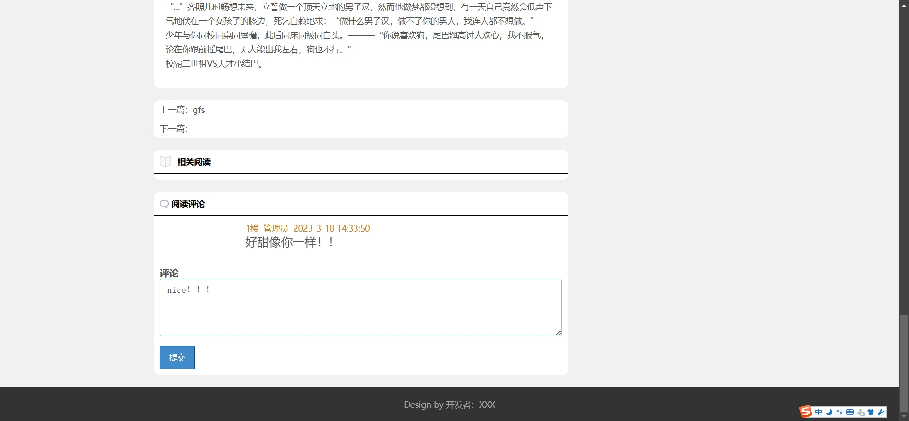

# 校园阅读系统(数据库加VX获取☟)
> VX：13033494971
#### 介绍
校园阅读系统（SSM）
有BUG可留言加微

#### 软件架构
Java + SSM(Spring+SpringMVC+Mybatis) + Mysql

#### 项目功能说明

1. 管理员功能
> + 用户管理：修改密码、修改用户信息
> + 阅读管理：搜索查看
> + 评论管理：搜索查看
2. 用户功能
> + 登录注册
> + 首页：阅读列表、基本信息、模块专栏
> + 阅读详情、文章评论
> + 写文章
> + 个人中心：阅读列表、阅读排行、我的评论、个人信息、安全中心

### 部分功能演示

### 环境需求(可免费提供)
- idea/eclipse、jdk-1.8、maven-3.8.6、mysql、redis、nodejs等

## 有项目修改、安装调试需求 请联系微信

## 其他项目定制加微☝☝☝
